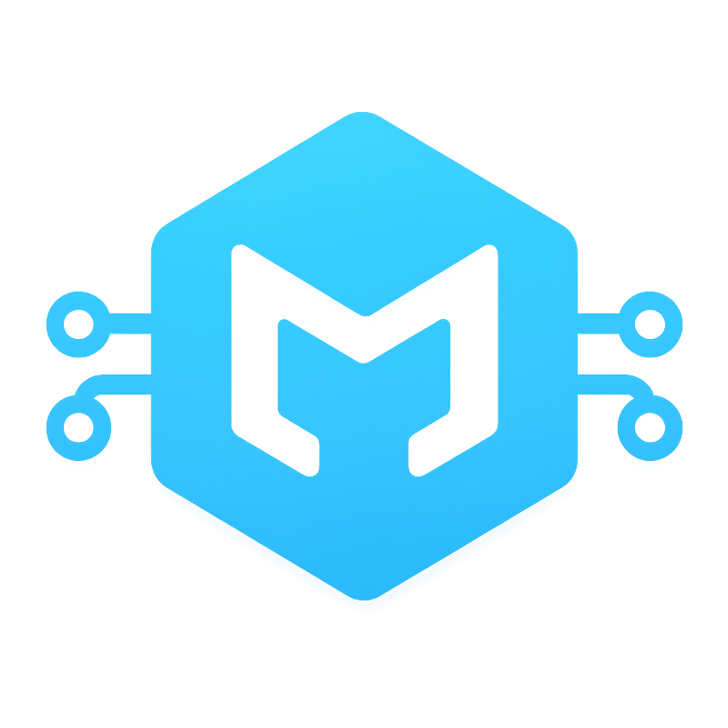
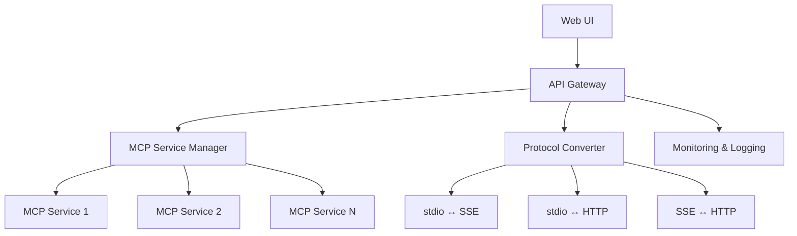

<div align="center">
  

# 🚢 MCP-Dock

**A Unified Management Platform for Model Context Protocol (MCP) Services**

[](https://github.com/BeliefanX/MCP-Dock/releases)
[](https://python.org)
[](LICENSE)
[](https://nodejs.org/)
[](https://fastapi.tiangolo.com)
[](https://github.com/modelcontextprotocol/python-sdk)

*Version 0.1.0*

[English](README.md) | [中文](README_CN.md)

</div>

## 🌟 Overview

MCP-Dock is an open-source solution that provides a centralized platform for managing Model Context Protocol (MCP) services. Deploy it on your NAS or VPS to unify multiple MCP servers, enable cross-platform reuse, and serve them through standardized endpoints.

### ✨ Key Features

- 🏗️ **Centralized Management** - Deploy and manage multiple MCP services on NAS or VPS
- 🔌 **Multi-Protocol Support** - Support for stdio, SSE, and streamableHTTP MCP service formats
- 🌐 **Unified Endpoints** - Provide standardized SSE or streamableHTTP endpoints
- 🎯 **MCP Inspector Compatible** - Full compatibility with MCP Inspector for debugging and testing
- 📊 **Health Monitoring** - Monitor and manage the health status of multiple MCP services
- 🔄 **Protocol Conversion** - Seamless conversion between different MCP transport protocols
- 🧪 **Service Testing** - One-click testing of MCP service connections and tool retrieval
- 🎛️ **Proxy Customization** - Support for custom proxy descriptions and selective tool exposure
- ⚡ **Auto-Recovery** - Automatic service recovery and session management
- 🚀 **Auto-Start Support** - Automatic startup of services and proxies on application launch
- 🌍 **Flexible BASE URL** - Configurable global BASE URL for different deployment environments
- 📱 **Responsive Web UI** - Full-width tables and optimized interface for all screen sizes
- 🐳 **Docker Optimized** - Enhanced compatibility for containerized environments

## 🏗️ Architecture

### Core Principles

- **MCP Focus** - Dedicated to Model Context Protocol, no concept confusion
- **Official SDK Only** - Uses [official MCP SDK](https://github.com/modelcontextprotocol/python-sdk), no custom implementations
- **Modular Design** - Ensures easy upgrades and extensions
- **Target Users** - Individual users and developers
- **Hardware Compatibility** - Supports standard configurations

### System Architecture



### Module Design

| Module | Responsibility | Technology |
|--------|----------------|------------|
| **MCP Service Manager** | Lifecycle management of MCP services (install, start, stop, update, uninstall) | Official Python MCP SDK + Process management |
| **Protocol Converter** | Convert between different MCP formats (stdio, SSE, streamableHTTP) | Python async processing + Official SDK |
| **API Gateway** | Unified API endpoints, request routing, and load balancing | FastAPI + Uvicorn |
| **Monitoring & Logging** | Health status, performance metrics, and operation logs | Standard logging + Prometheus metrics |
| **Web UI** | User-friendly web interface for management and monitoring | Bootstrap 5 + Vanilla JavaScript |

## 🚀 Quick Start

### Prerequisites

- Python 3.12+
- [uv](https://github.com/astral-sh/uv) package manager
- [Node.js](https://nodejs.org/) (LTS version) with npm and npx
- 2GB+ RAM
- 200MB+ disk space

**Note**: The `start.sh` script will automatically detect and install missing dependencies (uv and Node.js) if they are not present on your system.

### Installation

1. **Clone the repository**
   ```bash
   git clone https://github.com/BeliefanX/MCP-Dock.git
   cd MCP-Dock
   ```

2. **Start the service (automatic dependency installation)**
   ```bash
   # Using the startup script (recommended - handles all dependencies automatically)
   ./start.sh
   ```

   The startup script will automatically:
   - Check for and install Node.js/npm/npx if missing
   - Check for and install uv if missing
   - Set up the Python virtual environment
   - Install all project dependencies
   - Start the MCP-Dock service

3. **Manual installation (if automatic installation fails)**
   ```bash
   # Install Node.js (if not already installed)
   # On Ubuntu/Debian:
   curl -fsSL https://deb.nodesource.com/setup_lts.x | sudo -E bash -
   sudo apt-get install -y nodejs

   # On macOS with Homebrew:
   brew install node

   # Install uv (if not already installed)
   curl -LsSf https://astral.sh/uv/install.sh | sh

   # Install project dependencies
   uv sync

   # Start manually
   uv run uvicorn mcp_dock.api.gateway:app --host 0.0.0.0 --port 8000
   ```

4. **Access the Web UI**
   
   Open your browser and navigate to: `http://localhost:8000`

### Configuration

Create your configuration file:

```bash
cp mcp_dock/config/mcp.config.example.json mcp_dock/config/mcp.config.json
```

Edit the configuration file to add your MCP services. See [Configuration Guide](#configuration) for details.

## 🛠️ Development

### Tech Stack

| Component | Technology | Version |
|-----------|------------|----------|
| **Backend** | Python | 3.12+ |
| **MCP SDK** | Official Python SDK | 1.9.0+ |
| **Web Framework** | FastAPI + Uvicorn | 0.100+ |
| **Frontend** | Bootstrap 5 + Vanilla JS | - |
| **Process Management** | psutil + subprocess | - |
| **Monitoring** | prometheus_client | - |
| **Package Manager** | uv | Latest |

### Development Setup

```bash
# Clone and setup development environment
git clone https://github.com/BeliefanX/MCP-Dock.git
cd MCP-Dock

# Install development dependencies
uv sync --dev

# Code formatting and linting
uv run ruff check .
uv run ruff format .
uv run mypy mcp_dock/

# Start development server
uv run uvicorn mcp_dock.api.gateway:app --reload --host 127.0.0.1 --port 8000
```

### Code Standards

- **Style**: PEP 8 compliance with ruff formatting
- **Type Hints**: Required for all functions and methods
- **Documentation**: Google-style docstrings

- **MCP Integration**: Official SDK only, no custom implementations

### Project Structure

```
mcp_dock/
├── 📁 core/                    # Core functionality
│   ├── mcp_service.py          # MCP service management
│   ├── mcp_proxy.py            # Protocol conversion
│   └── monitoring.py           # Monitoring & logging
├── 📁 api/                     # API Gateway
│   ├── gateway.py              # Main entry point
│   └── routes/                 # API route definitions
├── 📁 web/                     # Web UI
│   ├── static/                 # Static assets
│   └── templates/              # HTML templates
├── 📁 utils/                   # Common utilities
│   └── logging_config.py       # Logging configuration
├── 📁 config/                  # Configuration
│   └── README.md               # Configuration guide

└── main.py                     # Application entry point
```

## 📋 Configuration

### Configuration File Structure

MCP-Dock uses JSON configuration files with the following priority:

1. Explicitly provided config path (via startup arguments)
2. Project config directory: `mcp_dock/config/mcp.config.json`

### MCP Service Configuration (`mcp.config.json`)

```json
{
  "servers": {
    "notionApi": {
      "command": "npx",
      "args": ["-y", "@modelcontextprotocol/server-notion"],
      "transport_type": "stdio",
      "auto_start": true,
      "env": {
        "NOTION_API_KEY": "your-notion-api-key"
      }
    },
    "Tavily": {
      "url": "https://tavily.api.tadata.com/mcp/tavily/your-session-id",
      "transport_type": "sse",
      "auto_start": true
    }
  }
}
```

### Proxy Configuration (`proxy_config.json`)

```json
{
  "proxies": {
    "Notion_MCP": {
      "server_name": "notionApi",
      "endpoint": "/notion",
      "transport_type": "streamableHTTP",
      "auto_start": true,
      "exposed_tools": []
    },
    "Tavily_Proxy": {
      "server_name": "Tavily",
      "endpoint": "/tavily",
      "transport_type": "streamableHTTP",
      "auto_start": true,
      "exposed_tools": []
    }
  }
}
```

### Configuration Options

#### Service Configuration Options
- `auto_start`: Boolean - Automatically start the service when MCP-Dock launches
- `transport_type`: String - Protocol type ("stdio", "sse", "streamableHTTP")
- `env`: Object - Environment variables for stdio services
- `url`: String - Connection URL for remote services

#### Proxy Configuration Options
- `auto_start`: Boolean - Automatically start the proxy when MCP-Dock launches
- `server_name`: String - Name of the backend service to proxy
- `endpoint`: String - URL endpoint path for the proxy
- `transport_type`: String - Proxy protocol type ("sse", "streamableHTTP")
- `exposed_tools`: Array - List of specific tools to expose (empty = all tools)

### Web UI Configuration

#### Global BASE URL Configuration
The web interface provides a global BASE URL configuration feature that allows you to customize the base URL for all proxy access links:

- **Development Environment**: Use local network IP (e.g., `http://10.10.10.118:8000`)
- **Production Environment**: Use domain name (e.g., `https://mcp.mydomain.com`)
- **Default Behavior**: Uses the current browser origin if not configured

This configuration is saved to browser local storage and persists across sessions.

### Supported Transport Combinations

MCP-Dock supports all combinations of backend and proxy transport types:

| Backend Type | Proxy Type | Status | Use Case |
|-------------|------------|---------|----------|
| **stdio** | **sse** | ✅ | Local services with SSE clients |
| **stdio** | **streamableHTTP** | ✅ | Local services with MCP Inspector |
| **sse** | **sse** | ✅ | Remote services with SSE clients |
| **sse** | **streamableHTTP** | ✅ | Remote services with MCP Inspector |
| **streamableHTTP** | **sse** | ✅ | HTTP services with SSE clients |
| **streamableHTTP** | **streamableHTTP** | ✅ | HTTP services with MCP Inspector |

### Protocol Types Explained

- **Backend `stdio`**: Local MCP servers running as child processes
- **Backend `sse`**: Remote MCP servers accessible via Server-Sent Events
- **Backend `streamableHTTP`**: Remote MCP servers accessible via HTTP JSON-RPC
- **Proxy `sse`**: Provides SSE streaming interface for clients
- **Proxy `streamableHTTP`**: Provides HTTP JSON-RPC interface (MCP Inspector compatible)

## 🚀 Deployment

### Production Deployment

```bash
# Production server
uv run uvicorn mcp_dock.api.gateway:app --host 0.0.0.0 --port 8000 --workers 4

# With Docker (coming soon)
docker run -p 8000:8000 -v ./config:/app/config mcp-dock:latest

# With systemd service
sudo cp scripts/mcp-dock.service /etc/systemd/system/
sudo systemctl enable mcp-dock
sudo systemctl start mcp-dock
```

### Environment Variables

```bash
# Optional environment variables
export MCP_DOCK_CONFIG_PATH="/path/to/config.json"
export MCP_DOCK_LOG_LEVEL="INFO"
export MCP_DOCK_HOST="0.0.0.0"
export MCP_DOCK_PORT="8000"
```

## 🤝 Contributing

We welcome contributions! Please see our [Contributing Guide](CONTRIBUTING.md) for details.

### Quick Contribution Steps

1. Fork the repository
2. Create a feature branch: `git checkout -b feature/amazing-feature`
3. Make your changes and add tests
4. Ensure code quality: `uv run ruff check . && uv run mypy mcp_dock/`
5. Submit a pull request

## 📚 Documentation

For comprehensive guides and technical documentation, visit the [docs/](docs/) directory:

- **[Configuration Guide](docs/CONFIGURATION_GUIDE.md)** - Complete setup and configuration examples
- **[Deployment Guide](docs/DEPLOYMENT_GUIDE.md)** - Production deployment instructions
- **[MCP Inspector Guide](docs/MCP_INSPECTOR_GUIDE.md)** - Testing with MCP Inspector
- **[Technical Documentation](docs/technical/)** - Architecture and implementation details

## 📄 License

This project is licensed under the GPL v3 License - see the [LICENSE](LICENSE) file for details.

## 📚 API Documentation

### Management API Endpoints

#### Proxy Management
| Endpoint | Method | Description |
|----------|--------|--------------|
| `/api/proxy/` | GET | List all proxies with status and tool counts |
| `/api/proxy/{name}/start` | POST | Start a specific proxy |
| `/api/proxy/{name}/stop` | POST | Stop a specific proxy |
| `/api/proxy/{name}/restart` | POST | Restart a specific proxy |
| `/api/proxy/{name}/status` | GET | Get detailed proxy status |
| `/api/proxy/{name}/update-tools` | POST | Refresh proxy tool list |
| `/api/proxy/` | POST | Create a new proxy configuration |
| `/api/proxy/{name}` | PUT | Update proxy configuration |
| `/api/proxy/{name}` | DELETE | Delete proxy configuration |

#### Service Management
| Endpoint | Method | Description |
|----------|--------|--------------|
| `/api/servers/` | GET | List all services with connection status |
| `/api/servers/{name}/start` | POST | Start a specific service |
| `/api/servers/{name}/stop` | POST | Stop a specific service |
| `/api/servers/{name}/restart` | POST | Restart a specific service |
| `/api/servers/{name}/status` | GET | Get detailed service status |
| `/api/servers/{name}/verify` | POST | Verify service and get tool list |
| `/api/servers/{name}/test` | POST | Test service initialization and get service info |
| `/api/servers/` | POST | Create a new service configuration |
| `/api/servers/{name}` | PUT | Update service configuration |
| `/api/servers/{name}` | DELETE | Delete service configuration |

### Dynamic Proxy Endpoints

Each configured proxy automatically gets multiple endpoint types:

#### SSE Endpoints (for streaming clients)
- `GET /{proxy_name}/{endpoint}` - SSE stream endpoint with session management
- `POST /{proxy_name}/messages` - SSE message handling endpoint

#### StreamableHTTP Endpoints (for MCP Inspector)
- `POST /{proxy_name}/{endpoint}` - Direct JSON-RPC endpoint
- `POST /{proxy_name}/messages` - StreamableHTTP message endpoint

#### Debug Endpoints
- `GET /debug/sessions` - View active SSE sessions

### Example Usage

```bash
# List all proxies
curl http://localhost:8000/api/proxy/

# Connect MCP Inspector to StreamableHTTP endpoint
curl -X POST http://localhost:8000/Notion_MCP/notion \
  -H "Content-Type: application/json" \
  -d '{"jsonrpc":"2.0","id":1,"method":"initialize","params":{"protocolVersion":"2024-11-05","capabilities":{},"clientInfo":{"name":"test","version":"1.0"}}}'

# SSE connection for streaming
curl -H "Accept: text/event-stream" http://localhost:8000/Notion_MCP/notion
```

## 🔧 Troubleshooting

### Common Issues

**1. Proxy shows 0 tools**
```bash
# Refresh tool list using the update button in web UI (simplified icon-only button)
# Or via API
curl -X POST http://localhost:8000/api/proxy/ProxyName/update-tools

# Check proxy status
curl http://localhost:8000/api/proxy/
```

**2. MCP Inspector connection fails**
- Ensure proxy `transport_type` is "streamableHTTP"
- Check proxy status: `curl http://localhost:8000/api/proxy/`
- Verify backend service is running
- Check for Zod validation errors in browser console

**3. SSE connection drops**
```bash
# Check session management
curl http://localhost:8000/debug/sessions

# Review server logs for connection errors
# Verify firewall/proxy settings for streaming
```

**4. Service won't start**
```bash
# Check service status
curl http://localhost:8000/api/service/

# Check service logs in terminal output
# Verify configuration files exist and are valid
```

**5. Port already in use**
```bash
# Find and kill process using port 8000
lsof -ti:8000 | xargs kill -9

# Or use the startup script (handles this automatically)
./start.sh
```

**6. Auto-start not working**
```bash
# Check service/proxy configuration
# Ensure auto_start: true is set in config files

# Check application logs for auto-start messages
# Services should show "auto-started/connected X services"
# Proxies should show "auto-started X proxies"

# Verify service status before proxy auto-start
curl http://localhost:8000/api/service/
```

**7. BASE URL configuration issues**
```bash
# BASE URL is saved in browser localStorage
# Clear browser storage if needed: localStorage.removeItem('mcp_dock_base_url')

# Verify URL format: must be http:// or https://
# Check browser console for validation errors

# Reset to default using the "Reset to Default" button in web UI
```

**8. Dependency installation issues**
```bash
# Node.js/npm/npx not found
# Check if Node.js is properly installed
node --version
npm --version
npx --version

# If missing, install manually:
# Ubuntu/Debian:
curl -fsSL https://deb.nodesource.com/setup_lts.x | sudo -E bash -
sudo apt-get install -y nodejs

# macOS:
brew install node

# Or download from: https://nodejs.org/
```

**9. uv installation issues**
```bash
# Check if uv is properly installed
uv --version

# If missing, install manually:
curl -LsSf https://astral.sh/uv/install.sh | sh

# Or via pip:
pip install uv

# Make sure uv is in PATH
export PATH="$HOME/.cargo/bin:$PATH"
echo 'export PATH="$HOME/.cargo/bin:$PATH"' >> ~/.bashrc
```

**10. MCP service startup failures**
```bash
# Check if required commands are available for stdio services
which npx  # Should return path if Node.js is installed
which uv   # Should return path if uv is installed

# Check service configuration
cat mcp_dock/config/mcp.config.json

# Test npx command manually
npx -y @modelcontextprotocol/server-notion --help

# Check environment variables for stdio services
env | grep -E "(NOTION_API_KEY|OPENAPI_MCP_HEADERS)"
```

### Debug Mode

```bash
# Enable debug logging
export MCP_DOCK_LOG_LEVEL="DEBUG"

# Start with verbose output
uv run uvicorn mcp_dock.api.gateway:app --log-level debug
```

## 🏆 Acknowledgments

- [Model Context Protocol](https://modelcontextprotocol.io/) - The official MCP specification
- [MCP Python SDK](https://github.com/modelcontextprotocol/python-sdk) - Official Python implementation
- [FastAPI](https://fastapi.tiangolo.com/) - Modern web framework for building APIs
- [uv](https://github.com/astral-sh/uv) - Fast Python package manager

## 🔗 Related Projects

- [MCP Inspector](https://github.com/modelcontextprotocol/inspector) - Official MCP debugging tool
- [MCP Servers](https://github.com/modelcontextprotocol/servers) - Collection of official MCP servers
- [Claude Desktop](https://claude.ai/download) - AI assistant with MCP support

---

<div align="center">

**Made with ❤️ by the BeliefanX**

[⭐ Star us on GitHub](https://github.com/BeliefanX/MCP-Dock) | [🐛 Report Issues](https://github.com/BeliefanX/MCP-Dock/issues) | [💬 Discussions](https://github.com/BeliefanX/MCP-Dock/discussions)

</div>
