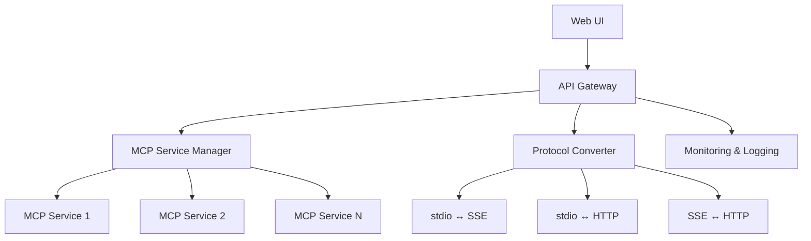

<div align="center">
  

# 🚢 MCP-Dock

**模型上下文协议 (MCP) 服务的统一管理平台**

[](https://github.com/BeliefanX/MCP-Dock/releases)
[](https://python.org)
[](LICENSE)
[](https://nodejs.org/)
[](https://fastapi.tiangolo.com)
[](https://github.com/modelcontextprotocol/python-sdk)

*版本 0.2.1*

[English](README.md) | [中文](README_CN.md)

</div>


## 🌟 概述

MCP-Dock 是一个开源解决方案，为管理模型上下文协议 (MCP) 服务提供集中化平台。将其部署在您的 NAS 或 VPS 上，统一管理多个 MCP 服务器，实现跨平台复用，并通过标准化端点提供服务。

### ✨ 核心特性

- 🏗️ **集中化管理** - 在 NAS 或 VPS 上部署和管理多个 MCP 服务
- 🔌 **多协议支持** - 支持 stdio、SSE 和 streamableHTTP MCP 服务格式
- 🌐 **统一端点** - 提供标准化的 SSE 或 streamableHTTP 端点
- 🎯 **MCP Inspector 兼容** - 完全兼容 MCP Inspector 进行调试和测试
- 📊 **健康监控** - 监控和管理多个 MCP 服务的健康状态
- 🔄 **协议转换** - 不同 MCP 传输协议之间的无缝转换
- 🧪 **服务测试** - 一键测试 MCP 服务连接和工具获取功能
- 🎛️ **代理定制** - 支持自定义代理描述和选择性工具暴露
- ⚡ **自动恢复** - 自动服务恢复和会话管理
- 🚀 **自动启动支持** - 应用启动时自动启动服务和代理
- 🌍 **灵活的 BASE URL** - 可配置的全局 BASE URL，适应不同部署环境
- 📱 **响应式 Web UI** - 全宽度表格和优化的界面，适配所有屏幕尺寸
- 🐳 **Docker 优化** - 增强的容器化环境兼容性

## 🏗️ 架构设计

### 核心原则

- **专注 MCP** - 专门针对模型上下文协议，避免概念混淆
- **仅使用官方 SDK** - 使用 [官方 MCP SDK](https://github.com/modelcontextprotocol/python-sdk)，无自定义实现
- **模块化设计** - 确保易于升级和扩展
- **目标用户** - 个人用户和开发者
- **硬件兼容性** - 支持标准配置

### 系统架构



### 模块设计

| 模块 | 职责 | 技术栈 |
|------|------|--------|
| **MCP 服务管理器** | MCP 服务的生命周期管理（安装、启动、停止、更新、卸载） | 官方 Python MCP SDK + 进程管理 |
| **协议转换器** | 不同 MCP 格式之间的转换（stdio、SSE、streamableHTTP） | Python 异步处理 + 官方 SDK |
| **API 网关** | 统一 API 端点、请求路由和负载均衡 | FastAPI + Uvicorn |
| **监控与日志** | 健康状态、性能指标和操作日志 | 标准日志 + Prometheus 指标 |
| **Web UI** | 用户友好的 Web 管理和监控界面 | Bootstrap 5 + 原生 JavaScript |

## 🚀 快速开始

### 前置要求

- Python 3.12+
- [uv](https://github.com/astral-sh/uv) 包管理器
- [Node.js](https://nodejs.org/) (LTS 版本) 包含 npm 和 npx
- 2GB+ 内存
- 200MB+ 磁盘空间

**注意**: `start.sh` 脚本会自动检测并安装系统中缺失的依赖项（uv 和 Node.js）。

### 安装步骤

1. **克隆仓库**
   ```bash
   git clone https://github.com/BeliefanX/MCP-Dock.git
   cd MCP-Dock
   ```

2. **启动服务（自动依赖安装）**
   ```bash
   # 使用启动脚本（推荐 - 自动处理所有依赖项）
   ./start.sh
   ```

   启动脚本将自动：
   - 检查并安装缺失的 Node.js/npm/npx
   - 检查并安装缺失的 uv
   - 设置 Python 虚拟环境
   - 安装所有项目依赖
   - 启动 MCP-Dock 服务

3. **手动安装（如果自动安装失败）**
   ```bash
   # 安装 Node.js（如果尚未安装）
   # Ubuntu/Debian:
   curl -fsSL https://deb.nodesource.com/setup_lts.x | sudo -E bash -
   sudo apt-get install -y nodejs

   # macOS 使用 Homebrew:
   brew install node

   # 安装 uv（如果尚未安装）
   curl -LsSf https://astral.sh/uv/install.sh | sh

   # 安装项目依赖
   uv sync

   # 手动启动
   uv run uvicorn mcp_dock.api.gateway:app --host 0.0.0.0 --port 8000
   ```

4. **访问 Web UI**
   
   在浏览器中打开：`http://localhost:8000`

### 配置

创建配置文件：

```bash
cp mcp_dock/config/mcp.config.example.json mcp_dock/config/mcp.config.json
```

编辑配置文件以添加您的 MCP 服务。详情请参阅 [配置指南](#配置)。

## 🛠️ 开发

### 技术栈

| 组件 | 技术 | 版本 |
|------|------|------|
| **后端** | Python | 3.12+ |
| **MCP SDK** | 官方 Python SDK | 1.9.0+ |
| **Web 框架** | FastAPI + Uvicorn | 0.100+ |
| **前端** | Bootstrap 5 + 原生 JS | - |
| **进程管理** | psutil + subprocess | - |
| **监控** | prometheus_client | - |
| **包管理器** | uv | 最新版 |

### 开发环境设置

```bash
# 克隆并设置开发环境
git clone https://github.com/BeliefanX/MCP-Dock.git
cd MCP-Dock

# 安装开发依赖
uv sync --dev

# 代码格式化和检查
uv run ruff check .
uv run ruff format .
uv run mypy mcp_dock/

# 启动开发服务器
uv run uvicorn mcp_dock.api.gateway:app --reload --host 127.0.0.1 --port 8000
```

### 代码标准

- **风格**：符合 PEP 8，使用 ruff 格式化
- **类型提示**：所有函数和方法都需要类型提示
- **文档**：Google 风格的文档字符串

- **MCP 集成**：仅使用官方 SDK，无自定义实现

### 项目结构

```
mcp_dock/
├── 📁 core/                    # 核心功能
│   ├── mcp_service.py          # MCP 服务管理
│   ├── mcp_proxy.py            # 协议转换
│   └── monitoring.py           # 监控与日志
├── 📁 api/                     # API 网关
│   ├── gateway.py              # 主入口点
│   └── routes/                 # API 路由定义
├── 📁 web/                     # Web UI
│   ├── static/                 # 静态资源
│   └── templates/              # HTML 模板
├── 📁 utils/                   # 通用工具
│   └── logging_config.py       # 日志配置
├── 📁 config/                  # 配置
│   └── README.md               # 配置指南

└── main.py                     # 应用程序入口点
```

## 📋 配置

### 配置文件结构

MCP-Dock 使用 JSON 配置文件，优先级如下：

1. 明确提供的配置路径（通过启动参数）
2. 项目配置目录：`mcp_dock/config/mcp.config.json`

### MCP 服务配置 (`mcp.config.json`)

```json
{
  "servers": {
    "notionApi": {
      "command": "npx",
      "args": ["-y", "@modelcontextprotocol/server-notion"],
      "transport_type": "stdio",
      "auto_start": true,
      "env": {
        "NOTION_API_KEY": "your-notion-api-key"
      }
    },
    "Tavily": {
      "url": "https://tavily.api.tadata.com/mcp/tavily/your-session-id",
      "transport_type": "sse",
      "auto_start": true
    }
  }
}
```

### 代理配置 (`proxy_config.json`)

```json
{
  "proxies": {
    "Notion_MCP": {
      "server_name": "notionApi",
      "endpoint": "/notion",
      "transport_type": "streamableHTTP",
      "auto_start": true,
      "exposed_tools": []
    },
    "Tavily_Proxy": {
      "server_name": "Tavily",
      "endpoint": "/tavily",
      "transport_type": "streamableHTTP",
      "auto_start": true,
      "exposed_tools": []
    }
  }
}
```

### 配置选项

#### 服务配置选项
- `auto_start`: 布尔值 - MCP-Dock 启动时自动启动服务
- `transport_type`: 字符串 - 协议类型（"stdio"、"sse"、"streamableHTTP"）
- `env`: 对象 - stdio 服务的环境变量
- `url`: 字符串 - 远程服务的连接 URL

#### 代理配置选项
- `auto_start`: 布尔值 - MCP-Dock 启动时自动启动代理
- `server_name`: 字符串 - 要代理的后端服务名称
- `endpoint`: 字符串 - 代理的 URL 端点路径
- `transport_type`: 字符串 - 代理协议类型（"sse"、"streamableHTTP"）
- `exposed_tools`: 数组 - 要公开的特定工具列表（空 = 所有工具）

### Web UI 配置

#### 全局 BASE URL 配置
Web 界面提供全局 BASE URL 配置功能，允许您自定义所有代理访问链接的基础 URL：

- **开发环境**: 使用本地网络 IP（如 `http://10.10.10.118:8000`）
- **生产环境**: 使用域名（如 `https://mcp.mydomain.com`）
- **默认行为**: 如果未配置，则使用当前浏览器来源

此配置保存到浏览器本地存储，在会话间持久保存。

### 支持的传输组合

MCP-Dock 支持后端和代理传输类型的所有组合：

| 后端类型 | 代理类型 | 状态 | 使用场景 |
|----------|----------|------|----------|
| **stdio** | **sse** | ✅ | 本地服务与 SSE 客户端 |
| **stdio** | **streamableHTTP** | ✅ | 本地服务与 MCP Inspector |
| **sse** | **sse** | ✅ | 远程服务与 SSE 客户端 |
| **sse** | **streamableHTTP** | ✅ | 远程服务与 MCP Inspector |
| **streamableHTTP** | **sse** | ✅ | HTTP 服务与 SSE 客户端 |
| **streamableHTTP** | **streamableHTTP** | ✅ | HTTP 服务与 MCP Inspector |

### 协议类型说明

- **后端 `stdio`**: 作为子进程运行的本地 MCP 服务器
- **后端 `sse`**: 通过服务器发送事件访问的远程 MCP 服务器
- **后端 `streamableHTTP`**: 通过 HTTP JSON-RPC 访问的远程 MCP 服务器
- **代理 `sse`**: 为客户端提供 SSE 流式接口
- **代理 `streamableHTTP`**: 提供 HTTP JSON-RPC 接口（MCP Inspector 兼容）

## 🚀 部署

### 生产部署

```bash
# 生产服务器
uv run uvicorn mcp_dock.api.gateway:app --host 0.0.0.0 --port 8000 --workers 4

# 使用 Docker（即将推出）
docker run -p 8000:8000 -v ./config:/app/config mcp-dock:latest

# 使用 systemd 服务
sudo cp scripts/mcp-dock.service /etc/systemd/system/
sudo systemctl enable mcp-dock
sudo systemctl start mcp-dock
```

### 环境变量

```bash
# 可选的环境变量
export MCP_DOCK_CONFIG_PATH="/path/to/config.json"
export MCP_DOCK_LOG_LEVEL="INFO"
export MCP_DOCK_HOST="0.0.0.0"
export MCP_DOCK_PORT="8000"
```

## 🤝 贡献

我们欢迎贡献！请查看我们的 [贡献指南](CONTRIBUTING.md) 了解详情。

### 快速贡献步骤

1. Fork 仓库
2. 创建功能分支：`git checkout -b feature/amazing-feature`
3. 进行更改并添加测试
4. 确保代码质量：`uv run ruff check . && uv run mypy mcp_dock/`
5. 提交 Pull Request

## 📄 许可证

本项目采用 GPL v3 许可证 - 详情请参阅 [LICENSE](LICENSE) 文件。

## 📚 API 文档

### 管理 API 端点

#### 代理管理
| 端点 | 方法 | 描述 |
|------|------|------|
| `/api/proxy/` | GET | 列出所有代理及其状态和工具数量 |
| `/api/proxy/{name}/start` | POST | 启动特定代理 |
| `/api/proxy/{name}/stop` | POST | 停止特定代理 |
| `/api/proxy/{name}/restart` | POST | 重启特定代理 |
| `/api/proxy/{name}/status` | GET | 获取详细代理状态 |
| `/api/proxy/{name}/update-tools` | POST | 刷新代理工具列表 |
| `/api/proxy/` | POST | 创建新的代理配置 |
| `/api/proxy/{name}` | PUT | 更新代理配置 |
| `/api/proxy/{name}` | DELETE | 删除代理配置 |

#### 服务管理
| 端点 | 方法 | 描述 |
|------|------|------|
| `/api/servers/` | GET | 列出所有服务及其连接状态 |
| `/api/servers/{name}/start` | POST | 启动特定服务 |
| `/api/servers/{name}/stop` | POST | 停止特定服务 |
| `/api/servers/{name}/restart` | POST | 重启特定服务 |
| `/api/servers/{name}/status` | GET | 获取详细服务状态 |
| `/api/servers/{name}/verify` | POST | 验证服务并获取工具列表 |
| `/api/servers/{name}/test` | POST | 测试服务初始化并获取服务信息 |
| `/api/servers/` | POST | 创建新的服务配置 |
| `/api/servers/{name}` | PUT | 更新服务配置 |
| `/api/servers/{name}` | DELETE | 删除服务配置 |

### 动态代理端点

每个配置的代理自动获得多种端点类型：

#### SSE 端点（用于流式客户端）
- `GET /{proxy_name}/{endpoint}` - 带会话管理的 SSE 流端点
- `POST /{proxy_name}/messages` - SSE 消息处理端点

#### StreamableHTTP 端点（用于 MCP Inspector）
- `POST /{proxy_name}/{endpoint}` - 直接 JSON-RPC 端点
- `POST /{proxy_name}/messages` - StreamableHTTP 消息端点

#### 调试端点
- `GET /debug/sessions` - 查看活动的 SSE 会话

### 使用示例

```bash
# 列出所有代理
curl http://localhost:8000/api/proxy/

# 将 MCP Inspector 连接到 StreamableHTTP 端点
curl -X POST http://localhost:8000/Notion_MCP/notion \
  -H "Content-Type: application/json" \
  -d '{"jsonrpc":"2.0","id":1,"method":"initialize","params":{"protocolVersion":"2024-11-05","capabilities":{},"clientInfo":{"name":"test","version":"1.0"}}}'

# 用于流式的 SSE 连接
curl -H "Accept: text/event-stream" http://localhost:8000/Notion_MCP/notion
```

## 🔧 故障排除

### 常见问题

**1. 代理显示 0 个工具**
```bash
# 使用 Web UI 中的更新按钮刷新工具列表（简化的仅图标按钮）
# 或通过 API
curl -X POST http://localhost:8000/api/proxy/ProxyName/update-tools

# 检查代理状态
curl http://localhost:8000/api/proxy/
```

**2. MCP Inspector 连接失败**
- 确保代理 `transport_type` 为 "streamableHTTP"
- 检查代理状态：`curl http://localhost:8000/api/proxy/`
- 验证后端服务正在运行
- 检查浏览器控制台中的 Zod 验证错误

**3. SSE 连接断开**
```bash
# 检查会话管理
curl http://localhost:8000/debug/sessions

# 查看服务器日志中的连接错误
# 验证防火墙/代理设置以支持流式传输
```

**4. 服务无法启动**
```bash
# 检查服务状态
curl http://localhost:8000/api/service/

# 检查终端输出中的服务日志
# 验证配置文件存在且有效
```

**5. 端口已被占用**
```bash
# 查找并终止占用端口 8000 的进程
lsof -ti:8000 | xargs kill -9

# 或使用启动脚本（自动处理此问题）
./start.sh
```

**6. 自动启动不工作**
```bash
# 检查服务/代理配置
# 确保配置文件中设置了 auto_start: true

# 检查应用程序日志中的自动启动消息
# 服务应显示 "auto-started/connected X services"
# 代理应显示 "auto-started X proxies"

# 在代理自动启动前验证服务状态
curl http://localhost:8000/api/service/
```

**7. BASE URL 配置问题**
```bash
# BASE URL 保存在浏览器 localStorage 中
# 如需要可清除浏览器存储：localStorage.removeItem('mcp_dock_base_url')

# 验证 URL 格式：必须是 http:// 或 https://
# 检查浏览器控制台中的验证错误

# 使用 Web UI 中的"重置为默认"按钮重置为默认值
```

**8. 依赖安装问题**
```bash
# Node.js/npm/npx 未找到
# 检查 Node.js 是否正确安装
node --version
npm --version
npx --version

# 如果缺失，手动安装：
# Ubuntu/Debian:
curl -fsSL https://deb.nodesource.com/setup_lts.x | sudo -E bash -
sudo apt-get install -y nodejs

# macOS:
brew install node

# 或从官网下载：https://nodejs.org/
```

**9. uv 安装问题**
```bash
# 检查 uv 是否正确安装
uv --version

# 如果缺失，手动安装：
curl -LsSf https://astral.sh/uv/install.sh | sh

# 或通过 pip:
pip install uv

# 确保 uv 在 PATH 中
export PATH="$HOME/.cargo/bin:$PATH"
echo 'export PATH="$HOME/.cargo/bin:$PATH"' >> ~/.bashrc
```

**10. MCP 服务启动失败**
```bash
# 检查 stdio 服务所需的命令是否可用
which npx  # 如果安装了 Node.js 应返回路径
which uv   # 如果安装了 uv 应返回路径

# 检查服务配置
cat mcp_dock/config/mcp.config.json

# 手动测试 npx 命令
npx -y @modelcontextprotocol/server-notion --help

# 检查 stdio 服务的环境变量
env | grep -E "(NOTION_API_KEY|OPENAPI_MCP_HEADERS)"
```

### 调试模式

```bash
# 启用调试日志
export MCP_DOCK_LOG_LEVEL="DEBUG"

# 以详细输出启动
uv run uvicorn mcp_dock.api.gateway:app --log-level debug
```

## 📚 文档

如需完整的指南和技术文档，请访问 [docs/](docs/) 目录：

- **[配置指南](docs/CONFIGURATION_GUIDE.md)** - 完整的设置和配置示例
- **[部署指南](docs/DEPLOYMENT_GUIDE.md)** - 生产环境部署说明
- **[MCP Inspector 指南](docs/MCP_INSPECTOR_GUIDE.md)** - 使用 MCP Inspector 进行测试
- **[技术文档](docs/technical/)** - 架构和实现细节

## 🏆 致谢

- [Model Context Protocol](https://modelcontextprotocol.io/) - 官方 MCP 规范
- [MCP Python SDK](https://github.com/modelcontextprotocol/python-sdk) - 官方 Python 实现
- [FastAPI](https://fastapi.tiangolo.com/) - 用于构建 API 的现代 Web 框架
- [uv](https://github.com/astral-sh/uv) - 快速的 Python 包管理器

## 🔗 相关项目

- [MCP Inspector](https://github.com/modelcontextprotocol/inspector) - 官方 MCP 调试工具
- [MCP Servers](https://github.com/modelcontextprotocol/servers) - 官方 MCP 服务器集合
- [Claude Desktop](https://claude.ai/download) - 支持 MCP 的 AI 助手

---

<div align="center">

**由 BeliefanX 用 ❤️ 制作**

[⭐ 在 GitHub 上给我们点星](https://github.com/BeliefanX/MCP-Dock) | [🐛 报告问题](https://github.com/BeliefanX/MCP-Dock/issues) | [💬 讨论](https://github.com/BeliefanX/MCP-Dock/discussions)

</div>